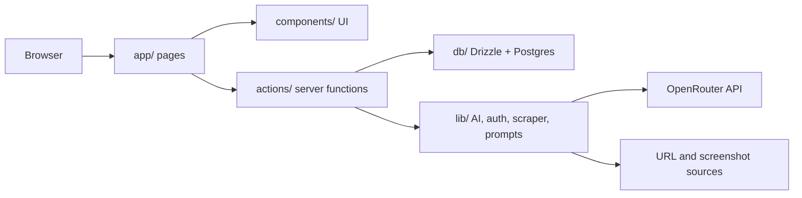

# Personalized Outreach Dashboard

This document explains the project end to end: what the app does, how the code is structured, how requests move through the system, why specific libraries were chosen, what broke during implementation, and how the deployment constraints shaped the final architecture.

The project is a Next.js app that helps a user:

1. Sign up and sign in with Better Auth.
2. Create and manage offerings.
3. Create prospects and enrich them with URLs, text, and screenshots.
4. Compile that prospect input into reusable context.
5. Generate outreach messages using OpenRouter.
6. Store generated messages, rate them, favorite them, delete them, and copy them.
7. Simulate a reply thread and generate a follow-up response.
8. Track basic analytics on the dashboard.

## High-Level Architecture

The app is split into four main layers:

1. `app/` for route entry points and page composition.
2. `components/` for reusable UI and client-side interaction logic.
3. `actions/` for server-side data access and mutation functions.
4. `lib/` and `db/` for shared infrastructure: auth, DB, AI, scraping, prompts, logging, and session helpers.

The key design choice is that the page files stay thin. They fetch data, enforce authentication, and compose components. The real business logic is pushed into reusable server actions and small client components.

## Tech Stack

### Framework

- Next.js 16.2.6
- React 19.2.6
- TypeScript
- Tailwind CSS 4

### Data

- Drizzle ORM
- PostgreSQL
- Supabase Postgres for hosted deployment
- Local Postgres in Docker for local development

### Auth

- Better Auth
- Better Auth Drizzle adapter

### AI and Extraction

- OpenRouter for text generation
- OpenRouter vision model for screenshot extraction
- `@extractus/article-extractor` for URL content extraction

### UI and Charts

- Recharts for dashboard charts
- Native browser APIs for clipboard, file input, and image compression

### Operational Support

- Docker and Docker Compose for local reproducible runs
- Vercel for deployment
- Railway was used during the earlier deployment exploration, but the final deployment path settled on Vercel plus Supabase

## Repository Structure

### Top-Level Files

- `app/` - route handlers and route segments.
- `actions/` - server actions grouped by domain.
- `components/` - reusable UI components.
- `db/` - schema and database client.
- `lib/` - auth, AI, scraper, prompts, session, logging, response parsing.
- `drizzle/` - generated migration SQL and snapshots.
- `proxy.ts` - request-level route protection.
- `Dockerfile` and `docker-compose.yml` - local containerized runtime.
- `project.md` - this document.
- `README.md`, `structure.md`, `plan.md`, `task.md` - supporting project docs.

### Logical Domains

- Auth and session management
- Offerings CRUD
- Prospect CRUD and enrichment
- Message generation and message history
- Reply-thread simulation
- Dashboard analytics
- Deployment/runtime configuration

## Routing Model

This app uses the Next.js App Router, so every folder under `app/` maps to a route segment.

### Public Routes

- `/` -> `app/page.tsx`
- `/login` -> `app/(auth)/login/page.tsx`
- `/signup` -> `app/(auth)/signup/page.tsx`

### Protected Routes

- `/dashboard` -> `app/(app)/dashboard/page.tsx`
- `/offerings` -> `app/(app)/offerings/page.tsx`
- `/offerings/[id]` -> `app/(app)/offerings/[id]/page.tsx`
- `/prompt` -> `app/(app)/prompt/page.tsx`
- `/prospects` -> `app/(app)/prospects/page.tsx`
- `/prospects/[id]` -> `app/(app)/prospects/[id]/page.tsx`

### API Routes

- `/api/auth/[...all]` -> Better Auth handler in `app/api/auth/[...all]/route.ts`
- `/api/generate` -> OpenRouter generation stream in `app/api/generate/route.ts`

### Route Guarding

Authentication gating is handled in `proxy.ts`. It checks for the Better Auth session cookie and redirects unauthenticated users away from protected routes.

Important detail:

- The proxy only protects app pages.
- It does not force redirect the auth pages back to the dashboard.
- That change was necessary to stop redirect loops caused by stale cookies during local development and deployment.

## Authentication Flow

### Entry Point

The auth API is handled by `app/api/auth/[...all]/route.ts`.

That file does not manually implement login logic. Instead, it delegates to Better Auth through `toNextJsHandler(getAuthClient())`.

### Why the Auth Client Is Lazy

`lib/auth.ts` creates the Better Auth client lazily through `getAuthClient()`.

That was necessary because Next.js build-time route analysis was trying to evaluate the auth module before runtime env vars were available. In practice:

- eager auth initialization caused build failures
- lazy initialization moved the dependency resolution to runtime

### How `lib/auth.ts` Works

`createAuthClient()` does three main things:

1. Reads `BETTER_AUTH_URL` and `BETTER_AUTH_SECRET`.
2. Creates a Better Auth instance with the Drizzle adapter.
3. Maps the database schema so Better Auth uses the app's `app_users` table.

The schema mapping matters because Better Auth expects a user model named `users` by default, but this app stores users in `app_users`.

### Why `app_users` Exists

The project originally used a generic `users` table, but that collided conceptually with Supabase auth tables and Better Auth defaults.

The final schema uses:

- `app_users` for application users
- Better Auth adapter mapping `user` and `users` to `appUsers`

That resolved the adapter error:

- model `users` not found in schema object

### Login and Signup Pages

The login and signup pages are client components:

- `app/(auth)/login/page.tsx`
- `app/(auth)/signup/page.tsx`

They submit JSON directly to Better Auth endpoints:

- `POST /api/auth/sign-in/email`
- `POST /api/auth/sign-up/email`

They use `readErrorMessage()` from `lib/parse-response.ts` so the UI can display a real message whether the response is JSON or text.

### Why `readErrorMessage()` Exists

Before this helper, the UI would crash or show unhelpful text when the auth API returned non-JSON responses.

That helper:

- checks the response content type
- reads JSON when possible
- falls back to raw text
- finally falls back to a default message

This reduced the amount of opaque "Unexpected end of JSON input" failures during auth debugging.

## Database Layer

### `db/schema.ts`

The schema defines every table used by the app:

- `appUsers`
- `accounts`
- `sessions`
- `verifications`
- `offerings`
- `userPrompts`
- `prospects`
- `messages`
- `conversations`

The schema also defines:

- type aliases for `ProspectInput` and `ConversationTurn`
- Drizzle relations between tables

### Core Relationships

- A user has many offerings, prospects, messages, sessions, and accounts.
- A prospect has many messages.
- A message belongs to one prospect and one offering.
- A message can have one conversation thread.
- A conversation belongs to one message.

### Why Relations Matter

The relations let the app do more than flat CRUD:

- dashboard queries can join messages and offerings
- prospect detail pages can load messages and threads
- message and conversation mutations can enforce ownership

### `db/index.ts`

`db/index.ts` creates the Drizzle client lazily:

- `getConnectionString()` reads `DATABASE_URL`
- `createDbClient()` creates the `pg` pool and Drizzle client
- `getDb()` caches the client
- `db` is a proxy so consumers can import `db` directly without eagerly constructing a connection at build time

### Why the DB Client Is Lazy

This project had build-time failures when Next.js attempted to evaluate DB code before runtime env vars existed.

Lazy initialization solved that by:

- preventing `DATABASE_URL` from being required during build analysis
- keeping the code safe in server components and route handlers

## Server Actions

The `actions/` folder is the business logic layer. Each domain has its own subfolder with:

- `auth.ts`
- `queries.ts`
- `mutations.ts`
- `types.ts`

The root barrel file re-exports the public functions.

This is a deliberate separation:

- queries read data
- mutations write data
- auth helpers centralize ownership checks
- types keep the calling components simple

### `actions/prospects`

#### `actions/prospects/auth.ts`

`requireUserId()` reads the session from Better Auth and throws `Unauthorized` if no user is present.

That helper is reused across most server actions so ownership checks are centralized.

#### `actions/prospects/queries.ts`

- `listProspects(search?)` returns all prospects for the current user.
- `getProspectById(prospectId)` returns one owned prospect or throws if it does not exist.

#### `actions/prospects/mutations.ts`

- `createProspect(input)` inserts a new prospect.
- `addInput(payload)` appends an input to the prospect, recompiles context, updates the row, and revalidates pages.
- `updateContext(payload)` manually updates the compiled context when needed.

The important part is `addInput()`:

1. Load the current prospect.
2. Append the new raw input.
3. Rebuild compiled context with `compileProspectContext()`.
4. Save both `inputs` and `extractedContext`.
5. Revalidate `/prospects` and `/prospects/[id]`.

#### `actions/prospects/extraction.ts`

This file handles every input type that can enrich a prospect:

- free text
- URLs
- LinkedIn screenshots

Key functions:

- `addInputWithExtraction(payload)` performs extraction and then calls `addInput()`
- `addInputFromFormData(prevState, formData)` is the form-compatible version used by `useActionState`

This file is where screenshot upload, file conversion, and URL extraction come together.

### `actions/offerings`

- `listOfferings()` reads the current user's offerings
- `createOffering(input)` inserts a new offering
- `updateOffering(id, input)` edits an existing offering
- `deleteOffering(id)` removes an offering

Offerings are the "sales context" used by the generation model. They define what the user actually sells.

### `actions/messages`

- `listMessagesByProspect(prospectId)` loads message history for one prospect
- `saveMessage(input)` stores a generated outreach message
- `rateMessage(input)` updates the 1-5 rating
- `toggleFavourite(input)` toggles the favorite flag
- `deleteMessage(messageId)` removes a stored message

The message actions are what make the generated output persistent and useful beyond one generation run.

### `actions/conversations`

- `getThread(messageId)` loads a conversation thread for one saved message
- `addReply(input)` appends a user or assistant turn to the thread

This is how the app simulates the follow-up loop after a prospect replies.

## AI and Prompting

### `lib/prompts.ts`

`DEFAULT_SYSTEM_PROMPT` defines the baseline behavior of the generator.

`buildSystemPrompt(userPrompt, offeringContent)` combines:

1. the custom user prompt or default prompt
2. the offering context

This keeps prompt behavior modular:

- the prompt page controls tone and style
- the offering controls what is being sold
- the prospect context controls who the message is written to

### `lib/ai.ts`

`generateMessageStream()` sends a chat-completions request to OpenRouter and returns a stream response.

Important behavior:

- it uses `AI_MODEL` or a default model
- it sends the request in streaming mode
- it parses the SSE-like response line by line
- it emits plain text tokens back to the browser

That design gives the UI a live-writing effect instead of waiting for a full response.

### Why Streaming Matters

Streaming is not just cosmetic.

It gives:

- faster perceived response
- better debugging visibility
- a lower chance of the interface feeling frozen

### `app/api/generate/route.ts`

This API route validates the payload before calling `generateMessageStream()`.

It rejects:

- missing `system` prompt
- missing or invalid `messages`

It also logs request metadata through `logger`.

## Screenshot and URL Extraction

### `lib/scraper.ts`

This file has two responsibilities:

1. URL extraction with `@extractus/article-extractor`
2. Screenshot extraction with OpenRouter vision models

#### `extractFromUrl(url)`

This function:

- fetches the page content
- extracts article-like text
- normalizes whitespace
- trims to a token budget

It is used for GitHub URLs, personal websites, company websites, and generic URLs.

#### `extractFromScreenshot(base64, mimeType)`

This function:

- tries the configured `VISION_MODEL`
- falls back to known vision models if the configured one is rejected
- sends the screenshot as a data URL with the correct MIME type
- returns normalized structured text

The fallback logic was necessary because `openrouter/free` was not a valid model ID in practice.

### Why the Screenshot Flow Uses a Browser-Side Compression Step

`components/prospects/add-input-form.tsx` compresses the screenshot in the browser before upload.

That reduces:

- upload size
- API request cost
- the chance of failed extraction due to oversized inputs

The flow is:

1. User selects a screenshot.
2. Browser compresses it to JPEG.
3. Form submits the file via `FormData`.
4. Server converts the file to base64.
5. `extractFromScreenshot()` sends it to OpenRouter.
6. Extracted text is saved as prospect input.

## Prospect Detail Page

`app/(app)/prospects/[id]/page.tsx` is the best place to understand the full product flow.

It composes three areas:

1. Left panel: inputs and compiled context
2. Add input form: enrichment UI
3. Right panel: generation and message history

### What It Loads

- the current user id from `getSessionUserId()`
- the target prospect from `getProspectById()`
- the user prompt from `db.query.userPrompts`
- the user offerings from `db.query.offerings`
- the message history from `listMessagesByProspect()`

### Why the Page Is Dynamic

The page exports `dynamic = "force-dynamic"` because it depends on per-request headers and session state.

If Next.js tries to treat it like static content, auth and personalization break.

### Client-Side Prospect Components

- `ProspectInputsPanel` shows each raw input
- `AddInputForm` adds new inputs
- `ProspectContextPanel` shows the compiled context
- `GeneratorPanel` manages generation, saved messages, and reply threads

## Message Generation Flow

### `components/prospects/generator-panel.tsx`

This is the orchestration component for the right pane.

It combines:

- generation controls
- live streaming output
- message history
- reply handling
- rating, favorite, copy, and delete actions

### `useMessageGeneration()`

This hook manages:

- selected offering state
- generation loading state
- streaming text state
- saved message state

Flow:

1. User selects an offering.
2. User clicks generate.
3. The hook builds the system prompt.
4. It POSTs to `/api/generate`.
5. It reads the stream incrementally.
6. It saves the final result through `saveMessage()`.
7. It prepends the saved message to the local list.

### `useMessageActions()`

This hook handles the post-generation actions:

- copy message
- rate message
- toggle favorite
- delete message

These actions update the server and then update local client state so the UI stays responsive.

### `MessageHistory`, `MessageCard`, `ReplyComposer`, `ThreadView`

These components separate concerns:

- `MessageHistory` renders the list
- `MessageCard` renders one message and its controls
- `ReplyComposer` collects the prospect reply
- `ThreadView` renders the conversation turns

This division is the reason the project no longer has giant page files.

### `useReplyThread()`

This hook manages the reply flow:

1. User opens the reply composer for a message.
2. Existing thread is loaded with `getThread()`.
3. User pastes the prospect reply.
4. The hook sends the original thread plus the new reply context to `/api/generate`.
5. The assistant follow-up is streamed and captured.
6. The hook persists both the user reply and the assistant follow-up via `addReply()`.
7. It refreshes the thread from the server as the canonical version.

That final refresh matters because the thread is the source of truth, not the temporary client state.

## Dashboard Flow

`app/(app)/dashboard/page.tsx` is a server component that computes metrics directly from the database.

It loads:

- total messages
- total prospects
- total offerings
- conversations with replies
- top offerings by usage
- message counts for the last 7 days

### `buildLast7Days()`

This helper takes raw grouped rows from SQL and normalizes them into a fixed 7-day series for the chart.

Why it exists:

- SQL results are sparse
- charts need every day represented
- missing days should show as zero, not disappear

### Why the Dashboard Is Server-Side

The dashboard does not need client-side fetching.

Rendering it on the server gives:

- simpler code
- fewer loading states
- direct DB access
- better control over session checks

## Offerings Flow

### `/offerings`

This page lets the user create and view offerings.

It loads existing offerings and renders:

- `CreateOfferingForm`
- `OfferingList`

### `/offerings/[id]`

This page edits one offering and optionally imports source text from a URL.

It renders:

- `OfferingImportForm`
- `OfferingEditForm`

The import action:

1. checks the current user
2. verifies ownership
3. extracts the source URL
4. updates the offering
5. revalidates the offerings pages

The edit action:

1. checks ownership
2. updates the row
3. revalidates list and detail pages

## Prompt Flow

### `/prompt`

This page edits the default system prompt used by the generation flow.

It uses:

- `PromptEditor`
- `DEFAULT_SYSTEM_PROMPT`

The prompt is stored per user in `user_prompts`.

That means each account can tune the model's style independently.

## Logging and Debugging

### `lib/logger.ts`

The logger adds consistent structured logs with three levels:

- info
- warn
- error

It accepts a scope and optional key-value context so debugging output stays readable.

### Why Logging Matters Here

This app interacts with:

- auth
- a remote database
- a streaming model API
- file uploads
- server actions

Without logs, every failure becomes opaque. Logging made it much easier to isolate where a problem occurred:

- auth route
- DB query
- screenshot extraction
- generation stream
- server action mutation

## Deployment Constraints and What Broke

This project did not become stable by accident. Several things failed before the current version worked.

### 1. Build-Time Environment Failures

Problem:

- Next.js build tried to evaluate auth and DB code too early.
- `DATABASE_URL` and auth env values were required before runtime.

Fix:

- lazy DB client in `db/index.ts`
- lazy auth client in `lib/auth.ts`
- route handler creates the Better Auth handler inside the request

### 2. Better Auth and User Table Mismatch

Problem:

- Better Auth expected a `users` model
- the app had its own schema naming
- Supabase auth also complicated the mental model

Fix:

- renamed the application table to `app_users`
- mapped `user` and `users` to `appUsers`
- regenerated and applied migrations

### 3. Redirect Loops

Problem:

- stale cookies caused repeated redirects
- login pages and protected pages could bounce endlessly

Fix:

- proxy now only redirects protected routes
- auth pages no longer redirect to dashboard just because a cookie exists

### 4. Docker Standalone Build Missing Files

Problem:

- standalone build did not automatically include every source file needed by local startup scripts
- missing drizzle config and migration assets caused runtime failures

Fix:

- Dockerfile now copies the required Drizzle assets
- Docker Compose starts the app against a local Postgres service
- startup runs migrations before the server starts

### 5. Screenshot Model ID Failure

Problem:

- `openrouter/free` was not a valid vision model ID

Fix:

- set a valid vision model in env
- added fallback logic in `lib/scraper.ts`

### 6. Generic 500s During Auth and Server Components

Problem:

- some server component failures were opaque in production

Fix:

- safer session helper in `lib/session.ts`
- explicit redirects instead of throwing in page loaders
- safer response parsing in `lib/parse-response.ts`

## Why the Files Are Modular

The repo was deliberately broken down to avoid huge files.

### Good Examples

- `actions/prospects/*` separates queries, mutations, auth, and extraction
- `components/prospects/*` separates UI parts and hooks
- `actions/messages/*`, `actions/conversations/*`, `actions/offerings/*` follow the same structure

### Why This Matters

The project initially had several mega-files. Breaking them apart helped with:

- readability
- testability
- easier debugging
- avoiding accidental coupling
- keeping files under a reasonable size

## How the Main User Journey Works

### 1. Sign in

The user opens `/login` or `/signup`, submits credentials, and Better Auth creates the session cookie.

### 2. Set up an offering

The user creates an offering on `/offerings`, then can open `/offerings/[id]` to edit or import from a URL.

### 3. Customize the prompt

The user edits `/prompt` to shape tone and style.

### 4. Save a prospect

The user creates a prospect on `/prospects`, then opens the detail page.

### 5. Add context

The user adds:

- free text
- URLs
- LinkedIn screenshots

The app extracts text and compiles it into a single context block.

### 6. Generate a message

The user selects an offering and clicks generate.

The system prompt, offering content, and prospect context are sent to OpenRouter.

### 7. Save the message

The generated message is stored in `messages`, shown in history, and contributes to dashboard stats.

### 8. Handle a reply

The user opens the reply composer, enters a prospect reply, and generates a follow-up.

The app stores the thread in `conversations`.

### 9. Inspect analytics

The dashboard queries the database directly and shows usage metrics.

## What Changed Over Time

This is the practical history of the project:

1. Started with a basic Next.js outreach app.
2. Added Better Auth and Drizzle-based persistence.
3. Modularized actions into smaller folders.
4. Modularized UI into reusable components and hooks.
5. Added prospect inputs and compiled context.
6. Added URL extraction.
7. Added screenshot extraction for LinkedIn profile screenshots.
8. Added message generation with streaming output.
9. Added saved message actions like copy, rate, favorite, and delete.
10. Added reply-thread handling and follow-up generation.
11. Added dashboard analytics.
12. Fixed auth/build/deployment constraints.
13. Finalized Docker and Vercel/Supabase deployment paths.

## Practical Notes for Presenting the Project

If you are recording a walkthrough, the cleanest explanation order is:

1. Demo the app.
2. Explain the route structure.
3. Explain the data model.
4. Explain auth and protected routing.
5. Explain prospect enrichment and extraction.
6. Explain generation and streaming.
7. Explain the reply thread flow.
8. Explain dashboard analytics.
9. Explain deployment and the issues that were solved.
10. Explain what was learned about build-time envs, auth adapters, and external API constraints.

## Final Read

The final architecture is intentionally boring in the right places and flexible where it needs to be:

- boring for auth, DB, and route guards
- flexible for prompt tuning, prospect enrichment, and reply handling
- modular enough that each feature can evolve without turning the project back into a set of mega-files

That is the main engineering outcome of the project.
